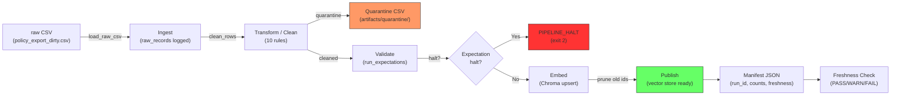

# Kien truc pipeline — Lab Day 10

**Nhom:** E403-36  
**Cap nhat:** 2026-04-15

---

## 1. So do luong (Mermaid)

**Diem do freshness:** tai buoc Publish — so sanh `latest_exported_at` trong manifest voi thoi diem hien tai.  
**run_id:** ghi trong log (`artifacts/logs/run_<run_id>.log`) va manifest (`artifacts/manifests/manifest_<run_id>.json`).  
**Quarantine:** luu tai `artifacts/quarantine/quarantine_<run_id>.csv` voi cot `reason` giai thich ly do loai.

---

## 2. Ranh gioi trach nhiem

| Thanh phan | Input | Output | Owner nhom |
|------------|-------|--------|------------|
| Ingest | `data/raw/policy_export_dirty.csv` | List[Dict] raw rows, raw_records count | Ingestion Owner |
| Transform | Raw rows | cleaned rows + quarantine rows (2 CSV) | Cleaning & Quality Owner |
| Quality | Cleaned rows | ExpectationResult list, halt boolean | Cleaning & Quality Owner |
| Embed | Cleaned CSV | Chroma collection (upsert + prune) | Embed Owner |
| Monitor | Manifest JSON | PASS/WARN/FAIL freshness status | Monitoring / Docs Owner |

---

## 3. Idempotency & rerun

- **Upsert theo `chunk_id`:** Moi chunk co ID on dinh (`{doc_id}_{seq}_{sha256_hash[:16]}`). Goi `col.upsert()` de cap nhat neu da ton tai.
- **Prune old ids:** Sau upsert, pipeline xoa cac id trong Chroma khong con trong cleaned run hien tai (`col.delete(ids=drop)`). Dam bao vector store la snapshot cua cleaned data moi nhat.
- **Rerun 2 lan:** Khong tao duplicate — lan 2 upsert ghi de cung chunk_id, prune khong xoa gi (vi id giong nhau). Log ghi `embed_prune_removed=0`.

---

## 4. Lien he Day 09

Pipeline Day 10 lam moi corpus cho retrieval trong Day 08/09:
- Cung thu muc `data/docs/` chua 5 file canonical policy.
- Sau khi pipeline embed thanh cong, Chroma collection `day10_kb` chua cleaned chunks san sang cho agent Day 09 truy van.
- Khac biet: Day 09 embed truc tiep tu file text; Day 10 qua ETL pipeline co cleaning, validation, va quarantine truoc khi embed — dam bao agent khong doc du lieu stale.

---

## 5. Rui ro da biet

- **Freshness SLA vuot:** Du lieu mau co `exported_at` co dinh (2026-04-10). Trong production can tu dong re-export theo lich.
- **Chunk_id phu thuoc seq:** Neu thu tu row thay doi giua cac lan export, chunk_id se khac -> prune xoa het va upsert lai toan bo. Can xem xet dung content-only hash.
- **Embedding model gioi han:** all-MiniLM-L6-v2 chi ho tro 256 tokens. Chunk dai bi cat ngam (truncate), lam giam chat luong retrieval. Rule 10 (max 2000 chars) giam thieu nhung chua triet de.
- **Khong co alerting tu dong:** Hien chi ghi log va manifest. Can tich hop alert (Slack/email) khi expectation FAIL hoac freshness FAIL.
